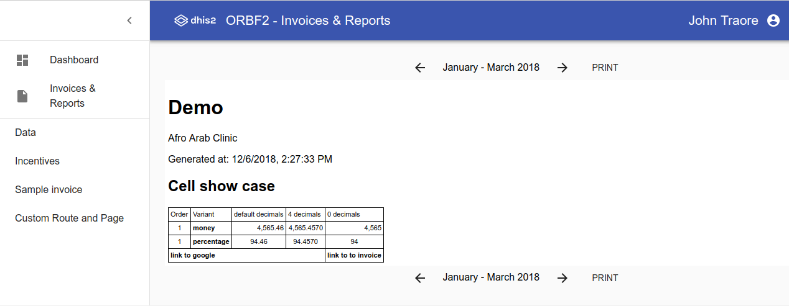

# blsq-report-components

> blsq-report-components

[](https://www.npmjs.com/package/@blsq/blsq-report-components) [](https://standardjs.com) [](https://travis-ci.com/BLSQ/blsq-report-components)

## Install

```bash
npm install --save blsq-report-components
```

or if you are more extreme, living on the edge, use the github repo and yarn

```bash
yarn add https://github.com/BLSQ/blsq-report-components
```

## Usage

Sorry we don't have yet documentation.

This is a skeleton app component where you can contribute custom routes, invoices & reports.



Your best chance is to look at the code and running the example app: https://github.com/BLSQ/blsq-report-components/blob/master/example/src/App.js


# Development

```
git clone git@github.com:BLSQ/blsq-report-components.git
cd blsq-report-components
npm install
./install_peer.sh
npm test
```

```
npm start
```

```
cd example
npm start
```


## License

MIT © [BLSQ](https://github.com/BLSQ)
